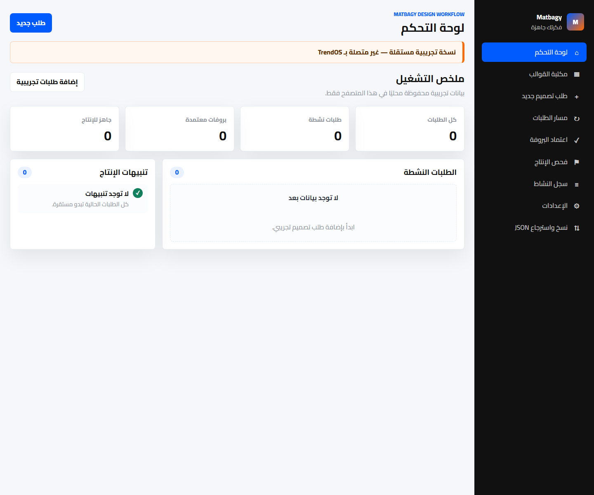
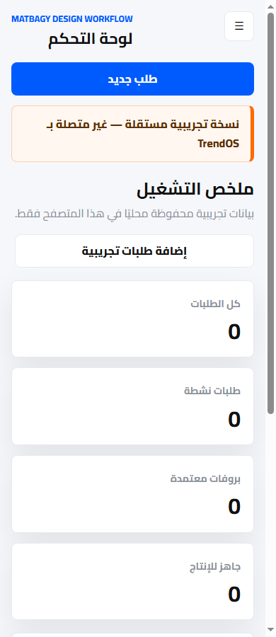

# Matbagy Design Workflow

Production-quality MVP for an independent, experimental Arabic RTL design workflow app.

> نسخة تجريبية مستقلة — غير متصلة بـ TrendOS

## Scope

- Static web application for GitHub Pages.
- Arabic RTL interface.
- No backend.
- No production-system connection.
- Test data is stored locally in the browser using `localStorage`.
- JSON backup and restore are available from the app.

## Modules

- Dashboard
- Design Template Library
- New Design Request
- Request Status Workflow
- Proof Approval
- Preflight Check Before Production
- Activity Log
- Settings
- JSON Backup and Restore

## Screenshots





## Run Locally

Open `index.html` directly in a browser, or serve the folder with any static file server.

Example:

```bash
python -m http.server 8080
```

Then visit:

```text
http://localhost:8080
```

## GitHub Pages

1. Open the repository settings on GitHub.
2. Go to **Pages**.
3. Under **Build and deployment**, choose **Deploy from a branch**.
4. Select the `main` branch and root folder `/`.
5. Save.

After this pull request is merged, GitHub Pages can serve the static app from the repository root.

## Data and Backups

All test data is stored in the current browser only. Use **نسخ واسترجاع JSON** inside the app to export or import:

- Templates
- Requests
- Proof state
- Preflight state
- Activity log
- Settings

## Safety

This MVP is intentionally isolated:

- Do not connect it to Matbagy, TrendOS, EasyStore, Google Sheets, or production systems.
- Do not use real customer data.
- Do not commit secrets or API keys.
- Treat all data as disposable test data.

## Known Limitations

- No authentication or user roles.
- No file uploads; image and output checks use filenames entered for test workflow simulation.
- No server-side validation.
- No real production export pipeline.
- Local browser storage can be cleared by the user or browser.

## Rollback

To roll back after merging:

1. Revert the merge commit in GitHub.
2. Disable GitHub Pages if the app should not remain publicly visible.
3. Ask testers to clear local browser data for this site if test data should be removed.
